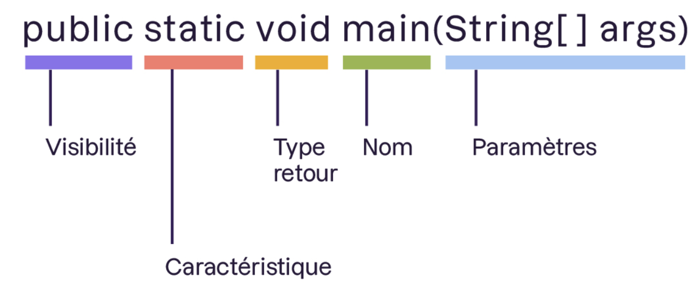

# Méthodes/Fonctions
Sous-programme qui permet d'effectuer un _ensemble d'instruction_ par simple _appel_ de cette dernière.

Doit être _déclaré_ au sein d'une __classe__.

__Java__ fournit des __méthodes/fonctions__ intégrées.

Possède :
- Une signature(_prototype_).
- Une implémentation, correspond aux _instructions_.
```java
public static void main(String[] args)
```


__Qualificateur de visibilité__:
- `private`.
- `protected`.
- Ne rien mettre, qui représente la visibilité `package`.

__Méthodes Statiques__:
- Appartiennent à la __classe__ elle-même.
- Ne peuvent pas accèder directement aux __attributs d'instance__.
- Sont appelées sur les __classes__: `Voiture.demarrer()`.
- Représentent généralement des _fonctionnalités_ liées à la __classe__ mais pas à un __objet__.

__Méthodes d'instances__:
- Appartiennent à une instance(__objet__) de la __classe__.
- Accès aux __attributs d'instance__ de la __classe__.
- Appelées sur l'__objet__: `maVoiture.demarrer()`.
- Représente _comportement_ de l'__objet__.


## Paramètres/Arguments
Des _infromations_ peuvent être transmises aux __méthodes/fonctions__. Ses __paramètres/arguments__ agissent comme des variables au sein de la __méthode/fonction__.
```java
public static void affiche(final String texte) {
    System.out.println(texte);
}
```
La __portée__ du __paramètre/argument__ est la __méthode/focntion__. En dehors de cette dernière impossible d'y accèder.

`final` peut-être mis devant les __paramètres/arguments__, c'est une _bonne pratique_ car ils ne sont pas voué à être _modifié_.


# Récursive
__Méthode/Fonction__ s'appelant elle-même. Permet la _décomposition_ des _problèmes complexes_ en _problèmes simples_.

Cette dernière doit possèder un __critère d'arrêt__ pour éviter de _boucler indéfiniment_.
```java
public static void décompte(final int valeur) {
    if(valeur >= 0) {
        System.out.println(valeur);
        décompte(valeur-1);
    }
}
```
