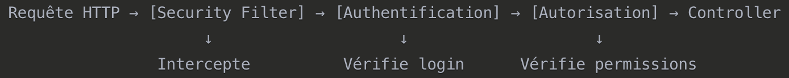

# Spring Security
__Module__ de sécurité `Spring`.

- `Authentification`: Connexion.
- `Autorisation`: Permissions.
- `Protection`: Contre les attaques(`CSRF`, `XSS`).

# Pourquoi configurer la sécurité ?
- `Spring Security` bloque __TOUT__ par défaut.
- Impossible d'accèder `API`
- Pas de gestion de mot de passe

# Architecture


# Configuration
`PasswordEncoder Bean`:
```java
@Configuration // ← Dit à Spring "ceci est une configuration"
@EnableWebSecurity // ← Active Spring Security
public class SecurityConfig {
    
    @Bean // ← Crée des objets gérés par Spring
    public PasswordEncoder passwordEncoder() {
        return new BCryptPasswordEncoder(); // Encodage sécurisé
    }
    
    @Bean
    public SecurityFilterChain filterChain(HttpSecurity http) {
        // Configuration des règles de sécurité
    }
}
```

`SecurityFilterChain`:
```java
@Bean
public SecurityFilterChain filterChain(HttpSecurity http) throws Exception {
    http
        .authorizeHttpRequests(auth -> auth
            .requestMatchers("/api/auth/**").permitAll() // Routes publiques
            .anyRequest().authenticated() // Reste protégé
        )
        .httpBasic(Customizer.withDefaults()); // Auth HTTP Basic
    return http.build();
}
```

__Désactivation__`CSRF`(pour APIs):
```java
.csrf(csrf -> csrf.disable())  // Désactive CSRF pour les API REST
```

# HTTP basic Authentication
- Username/password dans l'en-tête HTTP.
- Simple pour test et APIs.
- Format: `Authorization: Basic base64(username:password)`.

# Form-based Authentication
- Page de login HTML
- Application web traditionnelles

# JWT
- _Tokens_ sécurisés
- Applications modernes SPA

`JSON Web Token`: Permet __échange sécurisé__ de _jetons(tokens)_ entre plusieurs partie. Se traduit par la __vérification de l'intégrité et de l'authenticité des données__. S'effectue par l'algorithme `HMAC` ou `RSA`.

# Règle d'autorisation
__Routes publiques__(sans __authentification__):
```java
.requestMatchers("/api/auth/register").permitAll()
.requestMatchers("/api/catches").permitAll()  // Voir toutes les prises
```

__Routes protégées__(__authentification__):
```java
.requestMatchers("/api/catches/my").authenticated()      // Mes prises
.requestMatchers("/api/user/profile").authenticated()    // Mon profil
```

__Par rôles__:
```java
.requestMatchers("/admin/**").hasRole("ADMIN")
.requestMatchers("/user/**").hasRole("USER")
```
