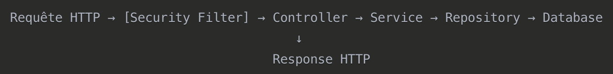

# Controller REST
`Controllers`(__API__) sont les points d'entrées de l'`API`. Reçoivent requêtes HTTP et orchestrent `Services` pour retourner les réponses.

`API`: Création __interface__ pour interargir avec l'application. Ensemble d'__endpoints HTTP__.
- Création compte utilisateur
- Connexion
- Ajouter des prise de pêche
- Consulter ses prises
- Gestion profil

# Architecture Controllers


## Annotations de CLASSE
`@RestController`:
- Marque classe comme `controller REST`.
- Combine `@Controller` + `@ResponseBody`.
- Toutes les méthodes retournent automatiquement `JSON`.

`@RequestMapping("/api/")`:
- Définit le préfixe __URL__ pour toute la __classe__.

## Annotations MÉTHODE HTTP
`@GetMapping`:
- Récupération données(Lire, consulter, récupérer).

`@PostMapping`:
- Création de données(Inscription, création, ajouter).

`@PutMapping`
- Modification données(MAJ données).

`@DeleteMapping`:
- Suppression donnéees.

## Annotations PARAMÈTRES
`@RequestBody`:
- Données dans le corps de la __requête__(`JSON`).
```java
public User register(@RequestBody User user)
// Reçoit un JSON qui sera converti en objet User
```

`@PathVariable`:
- Variable dans __URL__.
```java
@GetMapping("/{id}")
public User getUser(@PathVariable Long id)
// URL: /api/users/123 → id = 123
```

`@RequestParam`:
- Paramètres de requête(`query parameters`).
```java
@GetMapping("/search")
public List<Catch> search(@RequestParam String fishName)
// URL: /api/catches/search?fishName=truite
```