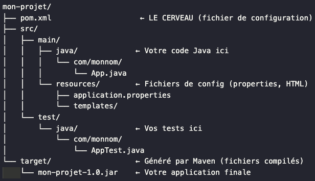
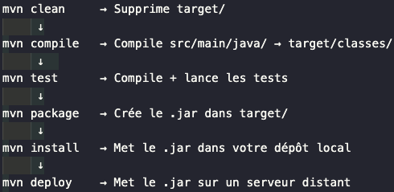

# Maven ?
_Outil de gestion_ de projet `Java`:
- _Télécharge automatiquement_ les __librairies__ dont on as besoin.
- _Compile_ le code.
- _Package_ application en un fichier(`.jar/.war`).

# Configuration
```xml
<!-- Dans pom.xml, vous écrivez juste : -->
<dependency>
    <groupId>org.springframework.boot</groupId>
    <artifactId>spring-boot-starter-web</artifactId>
</dependency>

<!-- Maven fait automatiquement :
✅ Télécharge Spring Boot
✅ Télécharge toutes les dépendances de Spring Boot (30+ fichiers)
✅ Gère les versions compatibles
✅ Compile votre code
✅ Crée le .jar final
-->
```

# Structure Projet Maven


# Fichier pom.xml
```xml
<?xml version="1.0" encoding="UTF-8"?>
<project xmlns="http://maven.apache.org/POM/4.0.0">
    
    <!-- INFORMATIONS DU PROJET -->
    <modelVersion>4.0.0</modelVersion>           <!-- Version de Maven -->
    <groupId>com.monnom</groupId>                <!-- Votre organisation -->
    <artifactId>mon-site-web</artifactId>       <!-- Nom du projet -->
    <version>1.0.0</version>                    <!-- Version de votre app -->
    <packaging>jar</packaging>                   <!-- Type de fichier final -->
    
    <!-- CONFIGURATION JAVA -->
    <properties>
        <maven.compiler.source>17</maven.compiler.source>    <!-- Version Java -->
        <maven.compiler.target>17</maven.compiler.target>
    </properties>
    
    <!-- DÉPENDANCES (librairies) -->
    <dependencies>
        <!-- Spring Boot -->
        <dependency>
            <groupId>org.springframework.boot</groupId>
            <artifactId>spring-boot-starter-web</artifactId>
            <version>3.2.0</version>
        </dependency>
        
        <!-- Base de données H2 -->
        <dependency>
            <groupId>com.h2database</groupId>
            <artifactId>h2</artifactId>
            <version>2.2.220</version>
        </dependency>
    </dependencies>
    
</project>
```

# Commandes Essentieles
```bash
# Télécharger toutes les dépendances
mvn dependency:resolve

# Compiler le projet
mvn compile

# Lancer les tests
mvn test

# Créer le fichier .jar final
mvn package

# Nettoyer les fichiers générés
mvn clean

# Tout faire d'un coup (nettoyer + compiler + tester + packager)
mvn clean package

# Lancer l'application Spring Boot
mvn spring-boot:run
```

# Cycle de Vie Maven
