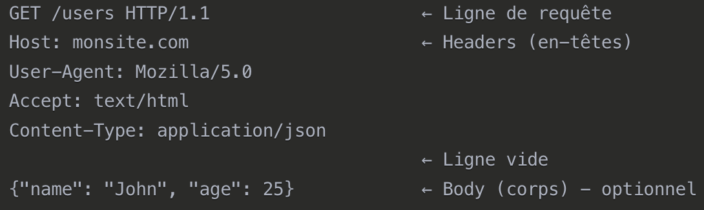
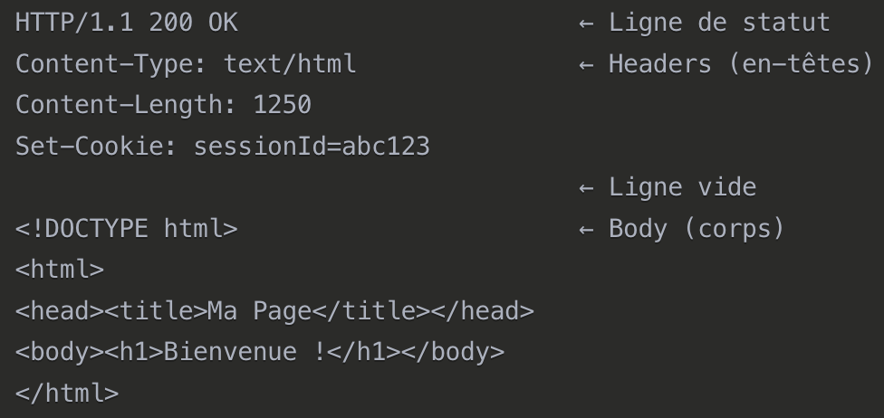
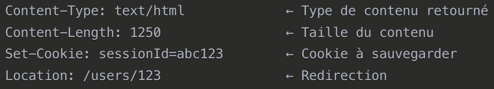

# HTTP
`HyperText Transfer Protocol` ets le __protocole de communication__ Web.

__Langage Standardisé__ que le _navigateur_ et le _serveur_ utilisent pour communiquer.

# Requête HTTP
Message que votre _navigateur_ envoie au _serveur_ pour demander quelquechose.

## Structures requête HTTP


## Méthode
- `GET`: Récupération de données
- `POST`: Création de données.
- `PUT`: Modifiaction de données.
- `DELETE`: Suppression de données

## Headers(En-têtes)
")

## Body(Corps)
```json
{
    "username": "john",
    "password": "secret123",
    "email": "john@example.com"
}
```

# Réponse HTTP
Message que le _serveur_ renvoie au _navigateur_ en réponse à la __requête__.

## Structure réponse HTTP


## Code Status
- `200`: OK
- `201`: Created
- `400`: Bad Request
- `401`: Unauthorized
- `404`: Not Found
- `500`: Server Error

## Headers


## Body(Corps)
```html
<!-- Pour une page web -->
<!DOCTYPE html>
<html>...</html>

<!-- Pour une API -->
{
    "id": 123,
    "name": "John Doe",
    "email": "john@example.com"
}
```
